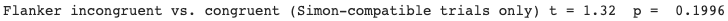
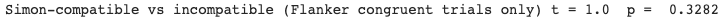

# Computing t-tests
The following codes work with aggregated data in a pandas DataFrame (df_agg) from a flanker-Simon experiment.

There are four conditions:
1) congruent (flanker)
2) incongruent (flanker)
3) compatible (Simon)
4) incompatible (Simon)

Three variables/pandas Series are created and each contain only the log RT data for one combination of flanker and Simon conditions (e.g., `fc_si` refers to flanker congruent and Simon incompatible). Then, 2 t-tests are performed on the log RT data.

```python
# Participant ID is set as the index of 'df_agg'
df_agg.set_index('id')
df_agg['log_rt'] = np.log(df_agg['clean_rt'])

# 3 variables created
fc_sc = df_agg[(df_agg['flankers'] == 'congruent') & (df_agg['simon'] == 'compatible')] ['log_rt']
fc_si = df_agg[(df_agg['flankers'] == 'congruent') & (df_agg['simon'] == 'incompatible')] ['log_rt']
fi_sc = df_agg[(df_agg['flankers'] == 'incongruent') & (df_agg['simon'] == 'compatible')] ['log_rt']


# Whether incongruent flanker trials are slower than congruent (for Simon-compatible trials only)
t, p = stats.ttest_rel(fi_sc, fc_sc)

print('Flanker incongruent vs. congruent (Simon-compatible trials only) t =', str(round(t, 2)),
      ' p = ', str(round(p, 4)))
```


 <br />

```python
# Whether Simon-incompatible trials are slower than compatible (for flanker-congruent trials only)
t, p = stats.ttest_rel(fc_si, fc_sc)

print('Simon-compatible vs incompatible (Flanker congruent trials only) t =', str(round(t, 2)),
      ' p = ', str(round(p, 4)))
```


 <br />


```

```
