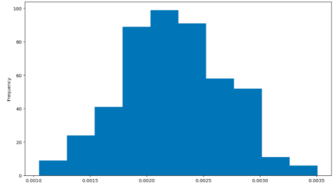

# Creating a Histogram
The following code works with reaction time (RT) data in a flanker experiment. There was a skew in the RT data, which posed an issue for running statistics. Therefore, a inverse transformation (i.e., 1/RT) was applied to make the RT data's distribution more statistically normal. Then, a histogram of the inverse-transformed RT data was plotted.

*Input*
```python
# Inverse-transform the RT data
df.loc[:,'rt_inv'] = 1/df['rt_ms']

# Plotting
df.loc[:,'rt_inv'].plot(kind='hist')

# Displays the plot
plt.show()
```
*Output*

 <br />. 
