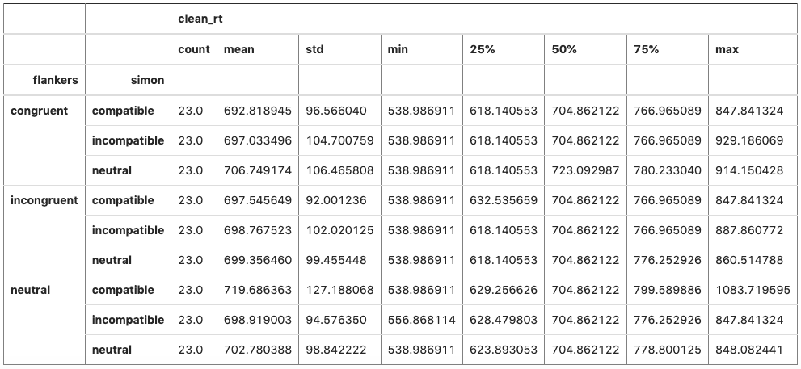
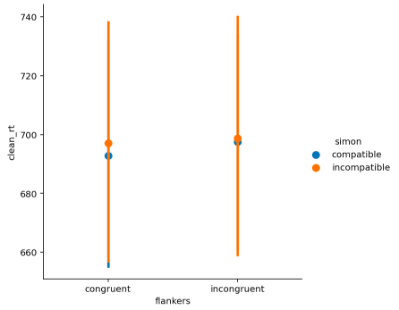

# Creating a Descriptive Statistics Table and Point Plot
The following code works with behavioural data from a "flanker-Simon" experiment. First, I generate a table of descriptive statistics grouped by flanker and Simon conditions in the DataFrame df_agg. Then I create a point plot with only the congruent and incongruent conditions (this required me to remove the neutral conditions from both the flankers and Simon data).

```python
# Table of descriptive statistics
df_agg.groupby(['flankers', 'simon']).describe()
```


 <br />. 

```python
# Creates a point plot with only the congruent and incongruent conditions
df_agg = df_agg[(df_agg.flankers != 'neutral') & (df_agg.simon != 'neutral')]

sns.catplot(kind='point', join=False,
           data=df_agg,
           x='flankers', y='clean_rt', hue='simon',
           order=['congruent', 'incongruent'])
           
# Displays the plot
plt.show()
```


 <br />. 
