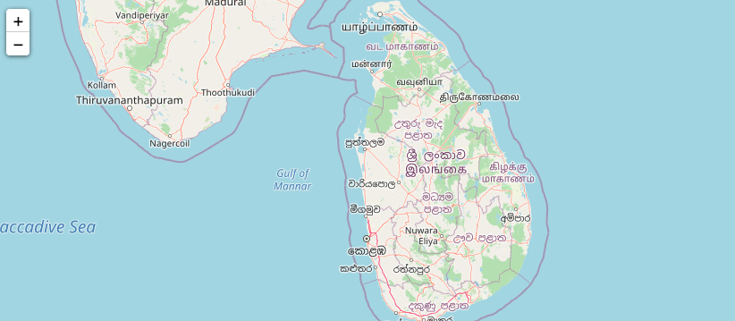

# Geospatial Visualization
The following code creates a map displaying Sri Lanka.

*Input*
```python
# Import the necessary library
# Folium is used for creating maps
import folium
```


```python
# The creates a map with the latitude
# And longitude coordinates of Sri Lanka 

m = folium.Map([6, 81], zoom_start=8)
```


```python
m
```
*Output*


 <br />
